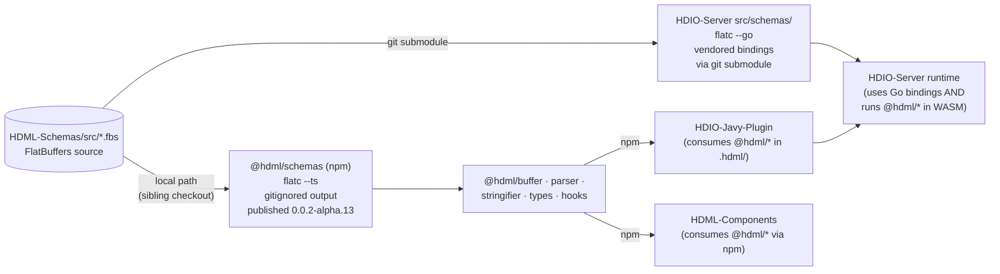

# Integration — how downstream repos consume HDML-Schemas

> **Scope:** The codegen invocations every consumer runs, what `flatc` flags they pass, and
> the rollout order when a `.fbs` changes. Open this when you're editing a schema or bumping
> the `flatc` pin. Type-level reference is in [schemas.md](schemas.md) and
> [enums.md](enums.md).

This repo has **no inbound dependencies** — nothing is built here. The "contract" is the file
layout under `src/` plus the pinned `flatc` version.

## Consumers



## TypeScript: `@hdml/schemas`

Lives at [packages/schemas/](../../HDML-Utilities-TS/packages/schemas/) in the
`HDML-Utilities-TS` monorepo. Build script
([packages/schemas/package.json](../../HDML-Utilities-TS/packages/schemas/package.json)):

```bash
flatc --ts --ts-omit-entrypoint -o ./src -I ../../HDML-Schemas/src ../../HDML-Schemas/src/*.fbs
```

- Reads `.fbs` files from a **sibling-directory local path** (`../../HDML-Schemas/src`) —
  *not* from a checked-in submodule.
- Generates into `packages/schemas/src/document/` and `packages/schemas/src/enum/`. Those
  paths are gitignored (`src/document`, `src/enum` in
  [packages/schemas/.gitignore](../../HDML-Utilities-TS/.gitignore)
  TODO(confirm: actual path)).
- Built/tsc'd into `cjs/`, `esm/`, `dts/`, `bin/` and published to public npm as
  `@hdml/schemas`. Other `@hdml/*` packages and `HDML-Components` depend on this npm version,
  not on the `.fbs` source directly.
- `flatbuffers` (the JS runtime) is pinned to **24.3.25** in
  [packages/schemas/package.json](../../HDML-Utilities-TS/packages/schemas/package.json),
  matching the `flatc` compiler version.

## Go: `HDIO-Server`

Vendors this repo as a **git submodule** under `HDIO-Server/HDML-Schemas/`. Build script
[scripts/run_fbs.sh](../../HDIO-Server/scripts/run_fbs.sh):

```bash
flatc --go \
  --go-module-name github.com/HDML-Foundation/HDIO-Server/src/schemas \
  -o /workspaces/HDIO-Server/src/schemas \
  -I /workspaces/HDIO-Server/HDML-Schemas/src \
  /workspaces/HDIO-Server/HDML-Schemas/src/*.fbs
```

- Output lands in `HDIO-Server/src/schemas/document/*.go` and
  `HDIO-Server/src/schemas/enum/*.go`. TODO(confirm: whether those `.go` files are committed
  to `HDIO-Server` or regenerated per-build — convention in the rewrite is the former, by
  inference from the `src/schemas/` package path used in `--go-module-name`.)
- The submodule pin (a specific commit of this repo) is the source-of-truth tying the Go
  bindings to a schema revision.

## Transitive consumers

- **`HDIO-Javy-Plugin`** — its `.hdml/` directory `npm ci`s the `@hdml/*` packages so the
  bundled JS (running inside `hdio.wasm` under Javy/QuickJS) can `import { … } from
  "@hdml/schemas"`. No direct `flatc` invocation.
- **`HDML-Components`** — depends on the published `@hdml/*` npm versions.

## Versions that must stay aligned

| Pin | Where | Why |
|---|---|---|
| `flatc` **v24.3.25** | [.devcontainer/Dockerfile](../.devcontainer/Dockerfile); also workspace-root [.devcontainer/Dockerfile](../../../.devcontainer/Dockerfile) | The compiler version. TS and Go bindings must be generated from one `flatc`/schema pair or the wire format diverges. |
| `flatbuffers` (JS runtime) **24.3.25** | [@hdml/schemas package.json](../../HDML-Utilities-TS/packages/schemas/package.json) | Runtime version must match the compiler version. |
| Schema revision | submodule SHA (Go) + npm version of `@hdml/schemas` (TS) | Both consumer toolchains must point at the same `.fbs` revision. |

Bumping `flatc` is a cross-repo operation: update the Dockerfile here and in every
consumer Dockerfile, then regenerate bindings everywhere.

## Schema-change rollout protocol

Order (always schema-first):

1. **Edit the `.fbs` in this repo.** Append-only for enums and tables; never reorder
   variants or remove fields (FlatBuffers tolerates appending optional fields but does not
   tolerate renumbering). See "Backwards compatibility" below.
2. **Validate locally** with `flatc` — see [development.md](development.md).
3. **Land + tag** here.
4. **`HDML-Utilities-TS`** — regenerate via `npm run compile_fbs` in `packages/schemas`,
   update `@hdml/parser` / `@hdml/stringifier` / `@hdml/types` / `@hdml/buffer` as needed,
   bump all `@hdml/*` versions in lockstep, publish.
5. **`HDIO-Server`** — bump the `HDML-Schemas` submodule pin, run
   [scripts/run_fbs.sh](../../HDIO-Server/scripts/run_fbs.sh), implement the
   orchestration/compiler changes, rebuild the predefined WASM modules
   (`hdml_parser.wasm` / `hdml_compiler.wasm`) from `@hdml/*`. TODO(confirm: build step for
   those `.wasm` modules — currently 0-byte placeholders per workspace-root CLAUDE.md.)
6. **`HDIO-Javy-Plugin`** — only if the new schema requires JS-side changes the plugin must
   expose; bump `.hdml/` deps and rebuild `hdio.wasm`.
7. **`HDML-Components`** — bump `@hdml/*` deps; expose any new authoring constructs.

The full workspace-level walkthrough lives at
[../../../CLAUDE.md §5](../../../CLAUDE.md#5-new-feature-implementation-checklist).

## Backwards compatibility

The same FlatBuffers structs are used for wire payloads **and** on-disk artifacts in
`HDIO-Server` (artifact path `usr/{tenant}/bin/…`). Treat schema changes accordingly:

- **Safe (additive):** appending a new optional field to a table; appending a new variant to
  the end of an enum or union; adding a new table.
- **Breaking:** renaming a field; reordering or renumbering an enum; removing a union
  variant; changing a field's type; changing an enum's base type. Any of these requires a
  data migration for existing on-disk artifacts, not just a coordinated build.
